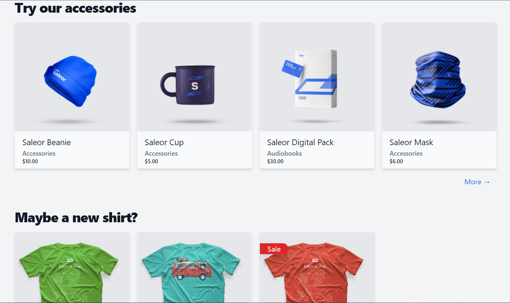

# React Storefront


Next Ecommerce is an open-source frontend e-commerce platform.



- Next.js
- TypeScript
- GraphQL with Apollo Client
- Tailwind CSS
- Saleor
- React Hook Form
- Next Auth

## Motivation

**modern & fast**:
Project is focusing on best practices for e-commerce, like: SSR & ISR, image optimization.

**easily customizable**:
TailwindCSS can be easily extended and tweaked, or completely changed to your favorite css solution.

### Configuration

The `.env` file contains environment variables used by the application. You can override them by creating `.env.local` file.

[Read more](https://nextjs.org/docs/basic-features/environment-variables)

### GraphQL queries

Graphql queries are located under the `./graphql`. We strongly encourage use of [fragments](https://graphql.org/learn/queries/#fragments), which minimizes code duplication and plays nicely with the TypeScript, during transformation of incoming data.

#### Workflow

- Modify or create GraphQL file. For example, new query at `./graphql/queries/FeaturedProducts.graphql`
- Run `npm run generate` command
- New query will be added to the `./saleor/api.tsx` file
- Import generated hook (`import { useFeaturedProductsQuery } from "@/saleor/api";`) in your component code

## React and Next.js code structure

Project use [file based routing](https://nextjs.org/docs/routing/introduction). Available routes can be found at `./pages`. Dynamic routes (for example `./pages/products/[slug].tsx`) are generated at build time based on [`getStaticPaths`](https://nextjs.org/docs/basic-features/data-fetching#getstaticpaths-static-generation).

When creating new components, please follow the [React TypeScript Cheatsheet](https://react-typescript-cheatsheet.netlify.app/docs/basic/getting-started/function_components/).


### Bundle metrics

If you want to check how your changes impact page size, use command:

```bash
npm run analyze-build
```
